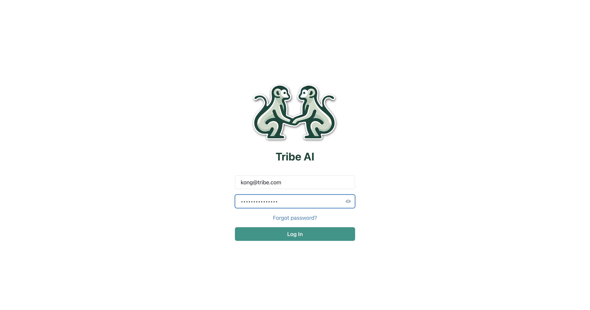
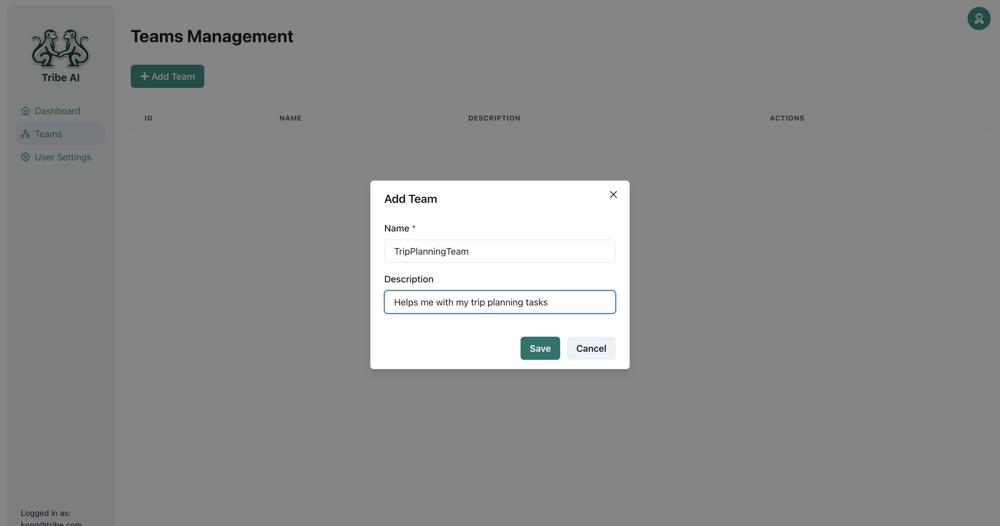
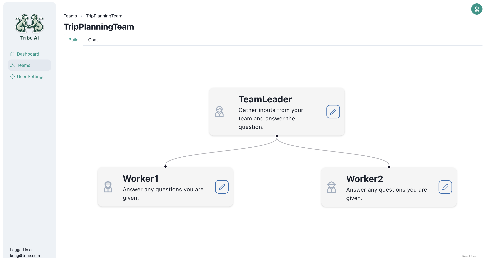
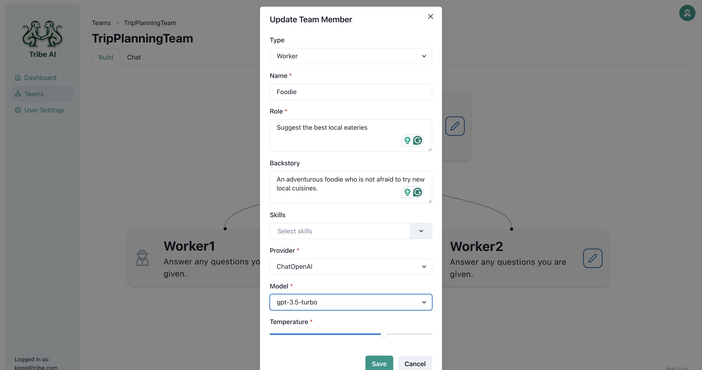
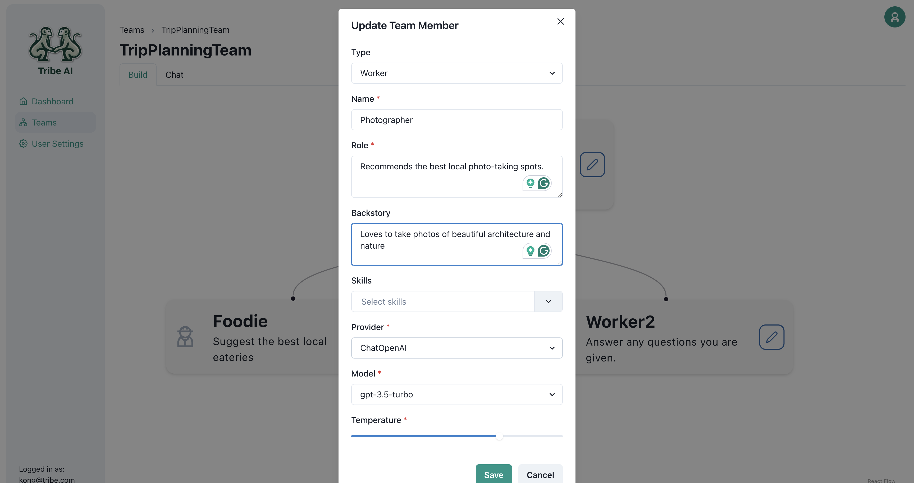
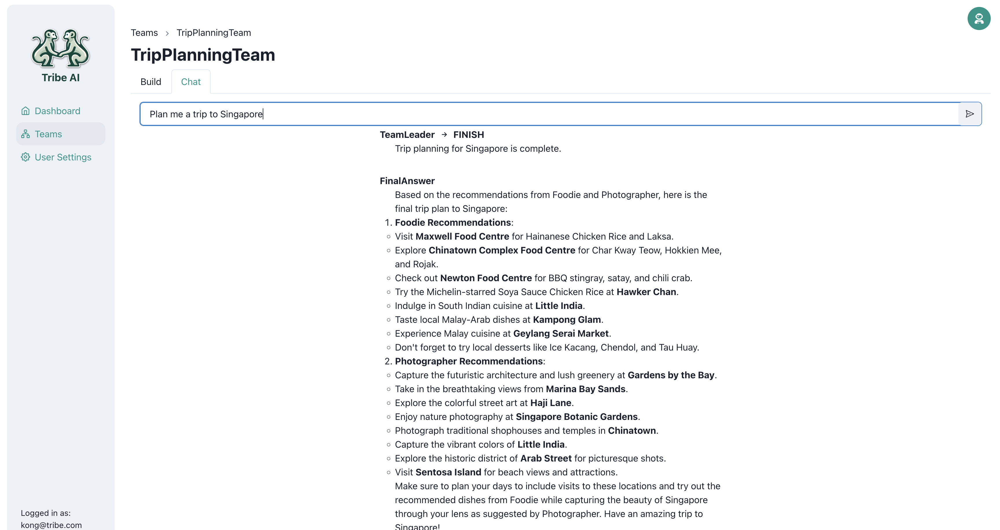

<div align="center">
  
  <h1>Tribe AI</h1>
  <p>✨ <b>Low code tool to rapidly build and coordinate multi-agent teams</b> ✨</p>
</div>

## What is Tribe?
Have you heard the saying, 'Two minds are better than one'? That's true for agents too. Tribe leverages on the langgraph framework to let you customize and coordinate teams of agents easily. By splitting up tough tasks among agents that are good at different things, each one can focus on what it does best. This makes solving problems faster and better.


## What are some use cases?
By teaming up, agents can take on more complex tasks. Here are a few examples of what they can do together:
- **⚽️ Footbal analysis**: Imagine a team of agents where one scours the web for the latest Premier League news, and another analyzes the data to write insightful reports on each team's performance in the new season.
- **🏝️ Trip Planning**:  For planning your next vacation, one agent could recommend the best local eateries, while another finds the top-rated hotels for you. This team makes sure every part of your trip is covered.
- **👩‍💻 Customer Service**:  A customer service team where one agent handles IT issues, another manages complaints, and a third takes care of product inquiries. Each agent specializes in a different area, making the service faster and more efficient.

and many many more!

## Benefits of Tribe
- **Rapid Team Design**: Build your agent teams quickly with an intuitive drag-and-drop interface. No coding experience required!
- **Versatile Model Support**: Tribe works seamlessly with multiple commercial AI models like OpenAI, Google, and Anthropic, and is currently enhancing support for local models.
- **Comprehensive Monitoring**: Use LangSmith to continuously monitor and test your agents to ensure peak performance.
- **Tool use**: Empower your agents with web search capabilities and easily craft custom skills using Python and LangChain.
- **Multi-User Support**: Tribe offers multi-user instances, allowing for collaboration and oversight across different teams.
- **Simple Deployment**: Implement Tribe effortlessly in your system using Docker, streamlining the setup process for various environments.

## Quick Start

### Configure

Update configs in the `.env` files to customise your configurations.

Before deploying it, make sure you change at least the values for:

- `SECRET_KEY`
- `FIRST_SUPERUSER_PASSWORD`
- `POSTGRES_PASSWORD`

You can (and should) pass these as environment variables from secrets.

Read the [deployment.md](./deployment.md) docs for more details.

### Generate Secret Keys

Some environment variables in the `.env` file have a default value of `changethis`.

You have to change them with a secret key, to generate secret keys you can run the following command:

```bash
python -c "import secrets; print(secrets.token_urlsafe(32))"
```

Copy the content and use that as password / secret key. And run that again to generate another secure key.


### Creating your first team

Log into Tribe using the email and password you defined during the installation step.

[](https://github.com/StreetLamb/tribe)

Navigate to the 'Teams' page and click on 'Add Team'. Enter a name for your team and click 'Save'.

[](https://github.com/StreetLamb/tribe)


Create two additional team members by dragging the handle of the Team Leader node.

[](https://github.com/StreetLamb/tribe)

Update the first team member as shown.

[](https://github.com/StreetLamb/tribe)

Update the second team member as shown.

[](https://github.com/StreetLamb/tribe)


Go to the 'Chat' tab and send a question to your team to see how they respond.

[](https://github.com/StreetLamb/tribe)

Congratulations! You’ve successfully built and communicated with your first multi-agent team on Tribe.

## Contribution

Tribe is open sourced and welcome contributions from the community! Check out our [contribution guide](./CONTRIBUTING.md) to get started.

Some ways to contribute:
- Report bugs and issues.
- Enhance our documentation.
- Suggest or contribute new features or enhancements.

## Release Notes

Check the file [release-notes.md](./release-notes.md).

## License

Tribe is licensed under the terms of the MIT license.
